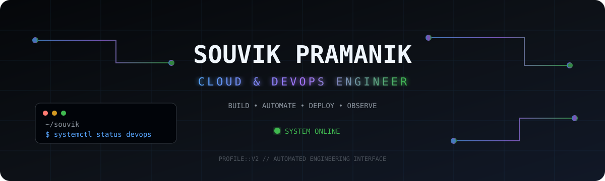
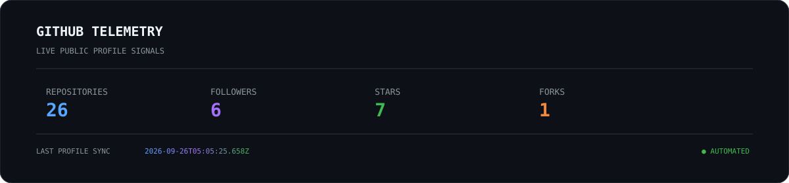
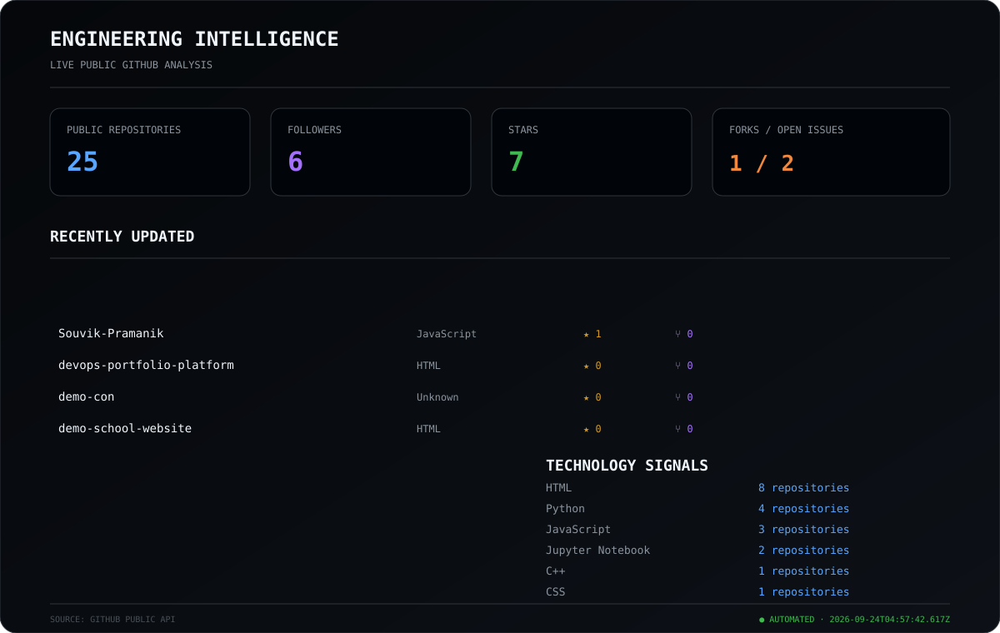

<div align="center">



<br><br>

<a href="https://github.com/Souvik-Pramanik">
  
</a>
<a href="https://www.linkedin.com/in/nukebyte/">
  
</a>
<a href="https://souvik-pramanik.github.io/">
  
</a>

</div>

---

# `01 // SYSTEM PROFILE`

```yaml
name: Souvik Pramanik
handle: Snaptokon
role: Cloud & DevOps Engineer

focus:
  - Cloud Infrastructure
  - DevOps Engineering
  - CI/CD Automation
  - Containerization
  - Infrastructure as Code
  - Linux & Systems
  - Monitoring & Observability
```

I work across **cloud infrastructure, automation, Linux systems, containers and CI/CD**, with an increasing focus on building reproducible and observable engineering systems.

> **Build → Automate → Deploy → Observe → Improve**

---

# `02 // CURRENT MISSION`

```text
APPLICATION
     │
     ▼
CONTAINERIZATION
     │
     ▼
CI / CD
     │
     ▼
INFRASTRUCTURE
     │
     ▼
ORCHESTRATION
     │
     ▼
OBSERVABILITY
     │
     ▼
RELIABILITY
```

### Current engineering focus

`Cloud Infrastructure` · `Docker` · `Kubernetes` · `CI/CD` · `Terraform` · `Linux` · `Automation` · `Observability` · `DevSecOps`

---

# `03 // LIVE GITHUB TELEMETRY`

<div align="center">



</div>

> Automatically generated from public GitHub repository and profile data.

---
# `04 // ENGINEERING INTELLIGENCE`

<div align="center">



</div>

> Repository and technology signals are generated automatically from public GitHub data.

---
# `05 // ENGINEERING STACK`

### ☁️ Cloud

<p align="center">
  
</p>

**AWS**

`EC2` · `S3` · `IAM` · `Lambda` · `ECS` · `EKS` · `CloudWatch`

**Azure**

`Compute` · `Storage` · `Cloud Infrastructure`

### 🐳 Containers & Orchestration

<p align="center">
  
</p>

`Docker` · `Docker Compose` · `Kubernetes`

### 🔄 CI/CD

<p align="center">
  
</p>

`GitHub Actions` · `Jenkins`

### 🏗️ Infrastructure as Code

<p align="center">
  
</p>

`Terraform` · `Ansible`

### 🐧 Systems & Automation

<p align="center">
  
</p>

`Linux` · `Bash` · `Python` · `Git` · `GitHub` · `Nginx` · `Networking`

### 📊 Observability

<p align="center">
  
</p>

`Prometheus` · `Grafana` · `CloudWatch`

---

# `06 // DEVOPS OPERATING MODEL`

```text
                        SOURCE CODE
                             │
                             ▼
                           GIT
                             │
                             ▼
                      CI / AUTOMATION
                             │
                             ▼
                           TEST
                             │
                             ▼
                          BUILD
                             │
                             ▼
                          DOCKER
                             │
                             ▼
                       CLOUD DEPLOY
                      AWS / AZURE
                             │
                             ▼
                       ORCHESTRATION
                     KUBERNETES / ECS
                             │
                             ▼
                       OBSERVABILITY
                  PROMETHEUS / GRAFANA
                             │
                             ▼
                         IMPROVE
                             │
                             └──────────► LOOP
```

---

# `07 // FEATURED ENGINEERING`

### 🐳 DevOps Portfolio Platform

A DevOps-focused engineering platform for demonstrating application delivery, containerization, automated testing and CI/CD workflows.

**Stack:** `Node.js` · `Docker` · `Jest` · `GitHub Actions`

[View repository](https://github.com/Souvik-Pramanik/devops-portfolio-platform)

---

### ⚛️ Quantum Image Processing

Research-oriented work exploring quantum image morphological operations for image restoration and enhancement.

**Stack:** `Python` · `Qiskit` · `OpenCV` · `PIL`

[View repository](https://github.com/Souvik-Pramanik/Quantum-Image-Processing)

---

### 🛡️ Carnage

Network-oriented engineering project exploring port scanning and automation.

**Stack:** `Python` · `Networking` · `Automation`

[View repository](https://github.com/Souvik-Pramanik/Carnage)

---

### 🤖 Face Mask Detection

Computer-vision application exploring real-time machine-learning inference and mobile deployment.

**Stack:** `Kotlin` · `CameraX` · `TensorFlow Lite`

[View repository](https://github.com/Souvik-Pramanik/Android-FaceMask-Detection_FDM_V2)

---

### 💬 Quote Of The Day

Web application demonstrating frontend development, API integration and deployment workflows.

**Stack:** `HTML` · `CSS` · `JavaScript` · `Node.js` · `Express`

[View repository](https://github.com/Souvik-Pramanik/Quote-Of-The-Day)

---

# `08 // GITHUB ACTIVITY`

<div align="center">

### Contribution Activity


<br>

### GitHub Statistics


<br>

### Language Distribution


<br>

### Contribution Streak


</div>

---

# `09 // DEVELOPMENT SIGNALS`

```text
┌─────────────────────────────────────────────────────────────┐
│                   DEVELOPMENT SIGNALS                       │
├─────────────────────────────────────────────────────────────┤
│                                                             │
│  COMMITS        → Implementation activity                   │
│  REPOSITORIES   → Engineering projects                      │
│  PULL REQUESTS  → Collaboration & delivery                  │
│  ISSUES         → Problem solving                           │
│  STARS          → Community interest                        │
│  FORKS          → Reuse & experimentation                   │
│  CONTRIBUTIONS  → Long-term GitHub activity                 │
│                                                             │
└─────────────────────────────────────────────────────────────┘
```

For the complete native activity timeline and contribution history:

[Open GitHub Profile](https://github.com/Souvik-Pramanik)

---

# `10 // CURRENTLY EXPLORING`

```text
☸   Kubernetes
🏗   Terraform
⚙️   Ansible
📊  Prometheus
📈  Grafana
🔐  DevSecOps
☁️   Advanced Cloud Architecture
🔄  Advanced CI/CD
```

---

# `11 // ENGINEERING PHILOSOPHY`

**01 — AUTOMATE**
Remove repetitive operational work.

**02 — REPRODUCE**
Infrastructure and environments should be repeatable.

**03 — OBSERVE**
Production systems need meaningful telemetry.

**04 — SECURE**
Security belongs inside the delivery lifecycle.

**05 — SIMPLIFY**
Complexity should have a reason to exist.

**06 — IMPROVE**
Every deployment, failure and experiment should improve the system.

---

# `12 // BEYOND DEVOPS`

My broader technical work has included:

`Backend Development` · `Machine Learning` · `Computer Vision` · `Quantum Computing` · `AI Systems` · `Embedded Systems` · `IoT` · `Mobile Development` · `Networking`

These areas provide a broader understanding of how **applications, infrastructure, data and hardware interact as complete systems**.

---

# `13 // ENGINEERING ROADMAP`

```text
CLOUD
  │
  ├─────────────┐
  ▼             ▼
DEVOPS       AUTOMATION
  │             │
  └──────┬──────┘
         ▼
    KUBERNETES
         │
         ▼
       IaC
         │
         ▼
  OBSERVABILITY
         │
         ▼
    DEVSECOPS
         │
         ▼
PRODUCTION SYSTEMS
```

---

# `14 // CONNECT`

<div align="center">

### `BUILD • AUTOMATE • DEPLOY • OBSERVE • IMPROVE`

<br>

<a href="https://github.com/Souvik-Pramanik">
  
</a>

<a href="https://www.linkedin.com/in/nukebyte/">
  
</a>

<a href="https://souvik-pramanik.github.io/">
  
</a>

<br><br>

```text
SYSTEM STATUS   : ONLINE
PROFILE VERSION : 2.1
TELEMETRY       : AUTOMATED
```

**© Souvik Pramanik**

</div>
